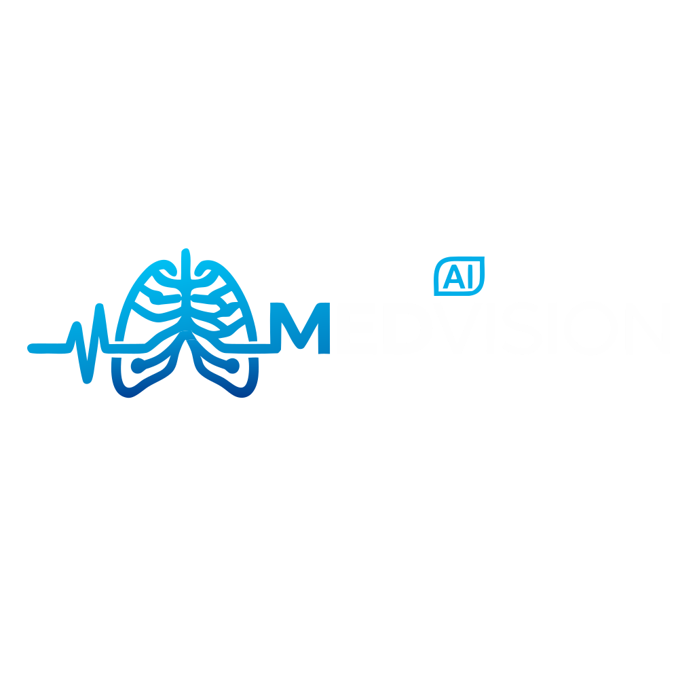

# MedVision

<p align="center">
  
</p>

**MedVision** is a web-based, multi-agent AI system for automated chest X-ray analysis and radiology report generation. It combines deep learning classification, explainable AI, and large language models into a single clinical decision-support pipeline — built to help doctors interpret chest X-rays faster and more reliably, without replacing their judgment.

## Why MedVision

Interpreting chest X-rays accurately takes real expertise and time — time that isn't always available in busy clinical settings. Most existing AI tools for this problem solve only one piece of the puzzle: classification *or* report generation *or* label extraction, in isolation, with no cross-checking between stages. That isolation is exactly where hallucinations and missed findings creep in.

MedVision instead runs the full diagnostic workflow as a **five-stage pipeline**, where each stage's output feeds into and is checked by the next:

1. Reject invalid/non-chest-X-ray uploads before they ever reach a diagnostic model
2. Classify the image against 14 known thoracic pathologies
3. Compare the result against the patient's own medical history
4. Generate a structured, natural-language report
5. Mathematically validate that the report doesn't contradict what was actually detected — and auto-correct it if it does

## The Multi-Agent Pipeline

| Stage | Name | Role |
|---|---|---|
| 0 | **Guard Agent** | Out-of-distribution detection — rejects non-chest-X-ray uploads (wrong modality, random photos) before they reach the diagnostic models |
| 1 | **Multimodal-Classifier-Agent (Layer 1)** | ConvNeXtV2-Base + Hierarchical Graph Attention Network — predicts 14 CheXpert pathologies with Grad-CAM explainability |
| 1.5 | **Multimodal-Classifier-Agent (Layer 2)** | Deterministic trend comparator — compares current findings against the patient's prior exams and chronic conditions |
| 2 | **Report-Generator-Agent** | Qwen2-VL-7B-Instruct (LoRA fine-tuned) — generates both a professional clinical report and a plain-language patient report |
| 3 | **Validator-Agent** | Dual-layer clinical validator — deterministic regex/negation check + LLM-as-a-Judge self-correction loop, catching omissions, contradictions, and hallucinations before a report reaches a doctor |

Orchestration runs through a FastAPI backend backed by a Redis job queue (RQ). Each uploaded exam is enqueued, dispatched to a dedicated GPU inference service, and its progress streamed back to the frontend over a WebSocket connection. Results persist in PostgreSQL.

### Agent 0 — Guard (OOD Detection)

A frozen, CheXpert-pretrained DenseNet121 backbone with a lightweight binary classification head. Trained on a **3-tier negative strategy** — generic photos (CIFAR-10), other imaging modalities (brain CT/MRI), and other-region X-rays (hand/knee/wrist fractures) — so the model learns genuine chest-X-ray anatomy rather than superficial "is this grayscale" cues. Achieves **0.9993 validation AUC**. Any image scoring below the threshold is rejected outright with a 406 response, so downstream agents never see invalid input.

### Agent 1 — Multimodal-Classifier-Agent (Visual Classification)

The core diagnostic engine. A single **ConvNeXtV2-Base** backbone, pretrained via FCMAE directly on chest X-rays (avoiding the domain gap that comes with ImageNet pretraining), feeds a **Hierarchical Graph Attention Network** that models the 14 CheXpert pathologies as a graph with clinical hierarchy and co-occurrence edges. Outputs are Platt-calibrated and hierarchy-enforced, so a child finding can never mathematically outrank its parent. Every prediction ships with a Grad-CAM heatmap so a clinician can see exactly which region of the image drove it.

### Agent 1.5 — Clinical Trend & History Comparator

A **deterministic Python logic engine** — not an LLM — that compares the current exam's findings against the patient's prior exams and known chronic conditions (heart failure, COPD, etc.), and flags acute-symptom correlations. LLMs are prone to hallucinating "worsening" trends that aren't real, so this comparison is done with exact mathematical deltas instead, and only the resulting structured summary is handed to the report generator.

### Agent 2 — Report-Generator-Agent

**Qwen2-VL-7B-Instruct**, LoRA fine-tuned (QLoRA 4-bit) on chest X-ray image-report pairs, chosen for its native dynamic-resolution vision encoder, strong instruction-following, and precise positional embeddings. The prompt explicitly grounds the model in Agent 1's predictions and Agent 1.5's trend analysis — the LLM's job is to *write*, not to *diagnose*. A single fine-tuned model generates both a formal clinical report and a plain-language, patient-friendly version, controlled by prompt swapping at inference time.

### Agent 3 — Validator-Agent

A **dual-layer safety net**:

- **Layer 1 (deterministic):** Regex-based entity extraction with clinical negation detection, comparing the generated report's stated findings against Agent 1's actual predictions. Classifies mismatches as *omissions*, *contradictions*, or *hallucinations*.
- **Layer 2 (LLM-as-a-Judge):** On failure, Qwen2-VL is re-engaged with the specific errors Layer 1 found and asked to rewrite the report. The correction is always re-validated through Layer 1 (max 2 attempts) before being accepted — if it still fails, the report is flagged for mandatory human review rather than silently shipped.

## Dataset

Trained on **MIMIC-CXR** (MIT/BIDMC) — chest X-ray images paired with radiology reports and structured pathology labels for 14 common thoracic conditions. Since MIMIC-CXR provides free-text reports rather than ready-made labels, ground-truth labels are self-generated from the report text using the `chexpert-labeler` NLP tool. Only frontal (PA/AP) views are used.

## Web Application

The clinical frontend (`webapp/`) is a React SPA where doctors can:

- Authenticate and manage their profile
- Search for and register patients
- Upload a chest X-ray and trigger the full AI pipeline
- Track exam progress in real time (WebSocket)
- Review pathology predictions, Grad-CAM heatmaps, and both report types
- View longitudinal exam history and trend analysis per patient
- Download finalized reports

Backend: FastAPI + PostgreSQL + Redis/RQ, with JWT-based authentication (python-jose + passlib/bcrypt).

## Repository Structure

```
medvision/
├── agent_guard/            # Agent 0 - OOD detection
├── agent_1_v2/             # Agent 1 - ConvNeXt pathology classification
├── agent_2_report/         # Agent 2 - clinical report generation (Qwen2-VL)
├── agent_3_validator/      # Agent 3 - clinical validation
├── agent_1_5_comparator/   # Agent 1.5 - temporal scan comparison
├── pipeline/                # Orchestration across agents 0-3
├── backend/                  # FastAPI backend (auth, patients, exams, DB models)
└── webapp/                   # React frontend
```

## Requirements

- NVIDIA GPU (developed against an A40, 24GB)
- Docker with NVIDIA Container Toolkit
- MIMIC-CXR dataset (not included, subject to PhysioNet credentialed access and licensing)

## Running the Stack

```bash
docker compose up -d --build
```

Services: webapp (React, served on :8080), backend (FastAPI, :8003), pipeline (GPU inference service, :8002), worker (RQ job consumer), db (PostgreSQL), redis.

## Status

Multi-agent pipeline (Agents 0-3) and full-stack web application functional end-to-end. See docs/PROGRESS.md for detailed session notes and current status.
